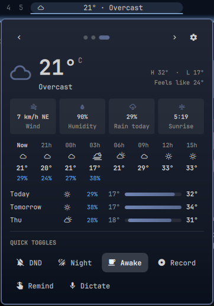
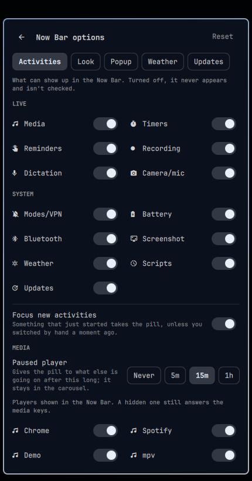

# omarchy-plugin-nowbar

A Samsung-style **Now Bar** for the [Omarchy](https://omarchy.org/) shell.
A single pill in the bar shows what's going on right now: music, a timer, a
screen recording, the camera being used... Scroll over it to switch between
activities, and click it for the details and controls.

## What it does

- **One pill for all live activities.** It shows the most important one, with
  a thin progress line and a `2/4` position marker. The pill keeps a fixed
  size; longer text scrolls around (or is cut with "…", if you prefer).
- **A popup carousel** with ‹ › arrows, dots and ←/→ keys. Each card has the
  details and that activity's buttons.
- **New activities take the pill** when they matter more than the current one
  (camera on, recording started...). Switching by hand pauses this for a few
  seconds.
- **Urgent activities turn red:** camera or microphone in use, screen
  recording, low battery, or a script that failed paint the pill and the
  popup red.
- **Dynamic colors:** media cards take their colors from the album cover, the
  weather card from the sky.
- **Charging glows blue to green:** while plugged in, the pill fills up to
  the charge with a blue-to-green gradient and a wave of light running
  through it, and the popup takes the same colors, at any percentage.
- **Motion:** the popup unfolds from the pill, its sections come in one
  after the other, cards slide in from the side you switched to, and the
  pill pulses red a few times when something urgent comes up. One switch
  turns it all off.
- **Quick toggles:** Do Not Disturb, night light, stay awake, screen
  recording, reminder and dictation, on and off. They can replace Omarchy's
  indicators widget.
- **Quick start:** timers, stopwatch, Pomodoro and a sleep timer for the
  media, one click away.
- **Weather card:** current conditions, the next hours and 3 days. When
  nothing else is going on, it is what the pill shows. It can replace
  Omarchy's weather widget.
- **Media keys:** the Now Bar takes over Omarchy's media controls (play/pause,
  next, previous, switching players), with the OSD.
- **Live updates from scripts:** your own scripts can show their progress in
  the pill, and `nowbar-run` does it for any command.

### Activities

| Samsung Now Bar         | Here                                                        | Source                                       |
| ----------------------- | ----------------------------------------------------------- | -------------------------------------------- |
| Media player            | One card per player: cover, title · artist, seekable progress bar, volume, play/pause, previous, next | MPRIS |
| Timer / Stopwatch       | Pause, +1 min, laps; a timer can also run until a time (`14:30`); kept across shell restarts | This plugin (notifies when the timer ends) |
| Focus modes             | Pomodoro: focus / break cycles, a long break every 4        | This plugin (notifies at each change)        |
| Media sleep timer       | Pauses every player when it ends                            | This plugin                                  |
| Alarms / reminders      | Countdown to the next reminder, clear                       | `omarchy-reminder`                           |
| Voice / screen recorder | Screen recording with elapsed time, stop                    | `gpu-screen-recorder`                        |
| Interpreter / voice     | Dictation: listening / transcribing                         | `omarchy-voxtype-status`                     |
| Privacy indicator       | Camera and/or microphone in use, which apps, mute the mic   | PipeWire, and who has `/dev/video*` open     |
| Modes & Routines / DND  | Do Not Disturb, stay awake, night light, VPN (while on), turn off | The shell's IPC, `nmcli`, `tailscale`  |
| Charging / battery      | `Charging · 63%` with time until full; low battery (≤ 15%) in red with time left | UPower                      |
| Connected devices       | A Bluetooth device that just connected, with its battery, for 10 s | Quickshell Bluetooth                  |
| Screenshot toolbar      | A screenshot just saved: thumbnail, Edit / Copy / Open, for 15 s | The screenshots folder                  |
| Now Brief               | Weather card, plus a notice when an Omarchy update is available | wttr.in, `omarchy-update-available`      |
| Live Updates (Android)  | Anything a script sends with `nowbar push`, or a command run with `nowbar-run` | IPC                         |

Not ported, since the desktop has no source for them: phone calls,
navigation, ride and food delivery, sports scores, wallet tickets, workouts.
Scripts can still show those through `push`.

## Preview

| Media, colored by its cover | Weather | Options |
| --- | --- | --- |
|  |  |  |

## Install

```bash
omarchy plugin add https://github.com/vinicgobbi/omarchy-plugin-nowbar --enable
```

No step needs `sudo`, polkit or the keyring.

### Optional dependencies

The Now Bar needs only Omarchy. **Everything below is optional: the plugin
works without any of it**, and only the part that uses a missing tool is left
out (or falls back to something simpler). Nothing has to be installed for it
to run.

| Tool (package)                        | Used for                                         | Without it                                        |
| ------------------------------------- | ------------------------------------------------ | ------------------------------------------------- |
| `inotifywait` (`inotify-tools`)       | Screenshot card; reminders shown at once; camera checked only when it opens or closes | No screenshot card; reminders show up within 10 s; the camera is checked every 5 s |
| `magick` / `identify` (`imagemagick`) | Cover art in media cards, and colors from it     | An icon instead of the cover; the theme's colors  |
| `curl` (`curl`)                       | Weather card; cover art from the internet        | No weather card; only covers stored on disk       |
| `wl-copy` (`wl-clipboard`)            | Copy on the screenshot card                      | Copy does nothing                                 |
| `xdg-open` (`xdg-utils`)              | Open on the screenshot card                      | Open does nothing                                 |
| `nmcli` (`networkmanager`)            | VPN connections in the Modes card                | VPN connections aren't shown                      |
| `tailscale` (`tailscale`)             | Tailscale in the Modes card                      | Tailscale isn't shown                             |
| `voxtype` (`voxtype`)                 | Dictation activity and the Dictate toggle        | Both are hidden                                   |

`jq`, which the scripts and a few checks use, comes with Omarchy.

**External services.** The weather card asks [wttr.in](https://wttr.in) for
the weather every 20 minutes (for the location saved in Omarchy, or a guess
from your IP), and an Omarchy update check runs every 3 hours; turning the
Weather activity off stops both. Cover art is downloaded from wherever the
player points to (https only, never this machine or the local network).

### What changes when you enable it

- **Omarchy's media widget turns off.** The Now Bar is a clone of the
  built-in `omarchy.media`: it takes over the media controls and the media
  keys, so the shell turns that widget off and puts the Now Bar in its place
  in the bar (on the left, if the media widget wasn't in the bar). Disabling
  or removing the Now Bar puts the media widget back.
- **Nothing else changes by itself.** Replacing Omarchy's weather and
  indicators widgets is up to you, with a button in the options (see
  [Weather](#weather) and [Indicators](#indicators)).

Don't enable omarchy-plugin-media at the same time: both would answer the
media keys.

## Usage

| Action        | Effect                                                          |
| ------------- | --------------------------------------------------------------- |
| Left click    | Open/close the popup                                            |
| Scroll        | Next / previous activity                                        |
| Middle click  | Main action of the activity (pause the timer, play/pause, stop...) |
| Right click   | Hide the activity until it changes (a new track, the timer paused...) |

### Popup keys

| Key              | Effect                                           |
| ---------------- | ------------------------------------------------ |
| ← / → (h / l)    | Previous / next activity                         |
| Tab / Shift+Tab  | Next / previous activity (in the options: tab)   |
| Enter / Space    | Main action                                      |
| x                | Hide the activity until it changes               |
| 1 – 6            | Start that Quick start timer                     |
| s                | Start the stopwatch                              |
| p                | Start a Pomodoro                                 |
| c                | Options                                          |
| q / Esc          | Close (or leave the options)                     |

The Quick start keys work while Quick start is shown in the popup.

> **Note:** while the popup is open it has the keyboard focus, like every
> Omarchy panel: keys you type go to the popup, so Space or Enter can pause
> the timer.

### Keyboard shortcuts

Shortcuts go in `~/.config/hypr/bindings.lua`. These keys are free in the
default Omarchy bindings:

```lua
o.bind("SUPER + period", "Now Bar: next activity", "omarchy-shell nowbar next")
o.bind("SUPER + SHIFT + period", "Now Bar: previous activity", "omarchy-shell nowbar prev")
o.bind("SUPER + ALT + period", "Now Bar: details", "omarchy-shell nowbar toggle")
o.bind("SUPER + CTRL + ALT + period", "Now Bar: main action", "omarchy-shell nowbar primary")
```

`primary` runs the focused activity's main action (play/pause, pause the
timer, stop the recording...) without opening the popup.

## Media keys

As a clone of `omarchy.media`, the Now Bar answers its `media` IPC target, so
Omarchy's media keys work with nothing else enabled:

| Key / command                                         | What it does                                       |
| ----------------------------------------------------- | -------------------------------------------------- |
| Play/Pause key, `omarchy-shell media playPause`       | Pauses what is playing; otherwise plays the focused card, the last player used, or any player with a track |
| Next / Previous keys, `media next` / `media previous` | On the focused player, else the one playing        |
| `media play` / `media pause`                          | Same choice of player                              |
| Shift+Play, `omarchy-audio-source-switch`             | Next player, moving the playback to it (`sourceSwitch`, `sourceSwitchPrevious`) |
| `media sourceNext` / `media sourcePrevious`           | Next / previous player, without touching playback  |
| `media status`                                        | JSON about the player the keys act on              |

Each action shows Omarchy's OSD with the track (after next/previous, the new
one).

A player that is playing gets a card; one you paused keeps its card (up to
3) so you can resume it, until it closes or you hide the card.

## Weather

The weather card uses the same source as Omarchy's weather widget (wttr.in),
the same saved location (`omarchy-weather-location`, else a guess from your
IP), and °C or °F the same way (or as set in the options). It shows:

- the temperature, condition and place, today's high and low, feels like;
- wind, humidity, today's chance of rain, and the next sunset (or sunrise);
- the next hours (3-hour steps), with the rain chance when it's 20% or more;
- today and the next 2 days, each with its range on a shared temperature bar.

It is one more card in the carousel (and in the `2/4` marker), but never takes
the pill from a live activity. `omarchy-shell nowbar weather` opens the popup
on it.

### Replacing Omarchy's weather widget

Click **Use instead of the weather widget** on the weather card, or **Replace
the weather widget** in the options (Weather tab). That turns `omarchy.weather`
off and points Omarchy's weather shortcut, SUPER+CTRL+ALT+W, at the weather
card. **Restore**, in the same place, undoes both and puts the widget back
where it was in the bar.

> **This edits your config:** the shortcut goes in
> `~/.config/hypr/bindings.lua`, inside a block marked
> `-- >>> vinicgobbi.nowbar weather` / `-- <<< vinicgobbi.nowbar weather`.
> A copy of the file is kept next to it first, as
> `bindings.lua.bak.nowbar-<time>`. Nothing changes until you click.

From a terminal:

```bash
~/.config/omarchy/plugins/vinicgobbi.nowbar/bin/nowbar-weather-widget replace   # or restore, status
```

## Indicators

The Now Bar does what Omarchy's indicators widget does. What is on shows up
as an activity (recording, dictation, reminders; Do Not Disturb, night light
and stay awake in the Modes card), and the popup's **Quick toggles** turn each
one on or off:

| Toggle  | On                                     | Off                     |
| ------- | -------------------------------------- | ----------------------- |
| DND     | Silences notifications                 | Allows them again       |
| Night   | Night light                            | Day light               |
| Awake   | No idle lock or screensaver            | Normal idle             |
| Record  | Opens Omarchy's screen recording menu  | Stops the recording     |
| Remind  | Opens Omarchy's reminder panel         |                         |
| Dictate | Opens voxtype's settings (if installed)|                         |

### Replacing Omarchy's indicators widget

Click **Use instead of Omarchy's indicators** under the Quick toggles, or
**Replace the indicators** in the options (Quick tab). That turns
`omarchy.indicators` off; its place in the bar is remembered, and **Restore**
puts it back there. With that widget off, the Now Bar also answers
`omarchy-shell omarchy.indicators refresh` (called by `omarchy-reminder` and
the screen recorder), so those show up at once.

From a terminal:

```bash
~/.config/omarchy/plugins/vinicgobbi.nowbar/bin/nowbar-indicators replace   # or restore, status
```

## Scripts

### `nowbar-run`: show any command in the pill

`bin/nowbar-run` runs a command in the foreground, exactly as given, and shows
it in the pill with the elapsed time. When it ends, the card turns into
"Done in 1:23" or "Failed (exit 2) after 1:23" for a while, and a notification
is sent.

```bash
~/.config/omarchy/plugins/vinicgobbi.nowbar/bin/nowbar-run make
~/.config/omarchy/plugins/vinicgobbi.nowbar/bin/nowbar-run -t "System update" -- omarchy-update
~/.config/omarchy/plugins/vinicgobbi.nowbar/bin/nowbar-run -q -- ./deploy.sh   # -q: no notification
```

To type just `nowbar-run`, add an alias to your shell's config:

```bash
alias nowbar-run="$HOME/.config/omarchy/plugins/vinicgobbi.nowbar/bin/nowbar-run"
```

Its exit code is the command's, and Ctrl+C goes to the command.

### Live updates: `nowbar push`

```bash
omarchy-shell nowbar push build '{"title":"Build #42","subtitle":"Compiling","progress":0.4,"pill":"Build 40%"}'
omarchy-shell nowbar push build '{"title":"Build #42","subtitle":"Done","progress":1,"ttl":30}'
omarchy-shell nowbar remove build
```

| Field      | Meaning                                                                   |
| ---------- | ------------------------------------------------------------------------- |
| `title`    | Required. Up to 80 characters                                             |
| `subtitle` | Second line in the popup                                                  |
| `pill`     | Shorter text for the pill (defaults to `title`)                           |
| `icon`     | A single Nerd Font glyph                                                  |
| `progress` | 0 to 1; leave it out for none                                             |
| `ttl`      | Seconds until it goes away on its own (max 24 h); leave it out to keep it |
| `priority` | `high`, `normal` (default) or `low`                                       |
| `urgent`   | `true` paints it red, like recording                                      |
| `state`    | `running`, `success` or `error` (red): sets the default icon              |
| `elapsed`  | `true` adds the time since the first push with this id                    |

The id is 1–32 letters, digits, `.`, `_` or `-`. Pushed activities are **text
only**: nothing in them is run, opened or shown as markup, and control
characters are stripped. At most 8 are kept, and they're gone after a shell
restart.

## IPC

Everything goes through `omarchy-shell nowbar <method> [args]`:

| Method                    | What it does                                                    |
| ------------------------- | --------------------------------------------------------------- |
| `next` / `prev`           | Switch the pill to the next / previous activity                 |
| `toggle`                  | Open/close the popup (on the focused monitor)                   |
| `focus <id or module>`    | Focus an activity: `timer`, `media`, `privacy`, `build`...      |
| `primary`                 | Main action of the focused activity                             |
| `act <activity> <action>` | Any action, e.g. `act timer cancel`, `act media next` (`media` is the focused player) |
| `dismiss`                 | Hide the focused activity until it changes (not the camera/mic card: only a click hides it) |
| `timer <duration>`        | Start a timer: `90` (seconds), `25m`, `1h30m`, or until `14:30` |
| `stopwatch`               | Start the stopwatch                                             |
| `pomodoro`                | Start a Pomodoro                                                |
| `sleep <duration>`        | Pause the media after `30` (minutes), `1h`, or at `23:00`       |
| `quick <id>`              | A Quick toggle: `dnd`, `nightlight`, `stayAwake`, `record`, `reminder`, `dictation` |
| `weather`                 | Open the popup on the weather card                              |
| `settings [tab]`          | Open the popup on the options (`activities`, `look`, `quick`, `weather`) |
| `push <id> <json>`        | Add or update an activity from a script                         |
| `remove <id>`             | Remove a pushed activity                                        |
| `status`                  | JSON with the activities, the focused one, the cover colors and the weather |

## Options

The gear in the popup (or `c`, or `omarchy-shell nowbar settings`) opens the
options, one tab at a time (Tab / Shift+Tab to switch):

- **Activities:** which activities can show up (live ones: media, timers,
  reminders, recording, dictation, camera/mic; system ones: modes and VPN,
  battery, Bluetooth, screenshots, weather, scripts), and whether a new
  activity takes the pill.
- **Look:** the pill's text width, scrolling or cutting long text, the
  progress line, the `2/4` marker, what it shows when idle (the weather card,
  an empty pill, or nothing), the dynamic colors, and the animations.
- **Quick:** the two rows at the bottom of the popup. Quick toggles: show
  them or not, which ones, and replacing (or restoring) Omarchy's indicators
  widget. Quick start: show it or not, the timers (minutes, comma separated;
  empty for none), which extras (stopwatch, Pomodoro, sleep timer), and the
  Pomodoro lengths.
- **Weather:** °C, °F or automatic, and replacing (or restoring) Omarchy's
  weather widget.

The same options are in the widget's settings. **Reset** restores them all.

## Details

- **Camera detection** reads which of *your own* processes have
  `/dev/video*` open (`/proc/<pid>/fd`, no root). With `inotify-tools`
  installed, it is checked only when a camera is opened or closed; without
  it, every 5 seconds.
- **Cover art** is downloaded only over https from public hosts (or read from
  a local file), capped at 8 MB and 4096 px, checked to be a real
  PNG/JPEG/GIF/WebP, and cached in `~/.cache/omarchy/vinicgobbi.nowbar`.
- **Modes:** Do Not Disturb and stay awake follow their state files, so they
  show up within a second; night light is checked every 5 seconds.
- **Reminders** show up as soon as `omarchy-reminder` sets them (watched with
  `inotify-tools`); without it, within 10 seconds.
- **Screenshots** are noticed in the folder `omarchy-capture-screenshot`
  saves to (`$OMARCHY_SCREENSHOT_DIR`, else `~/Pictures`), with
  `inotify-tools` installed. "Edit" opens `$OMARCHY_SCREENSHOT_EDITOR`
  (`tensaku-edit` by default).
- **Weather** is fetched every 20 minutes (and when the popup opens with a
  reading older than 10), and `omarchy-update-available` runs every 3 hours.
  Turning the "Weather" activity off stops both.
- **Timers, stopwatch, Pomodoro and sleep timer** are kept in
  `~/.local/state/vinicgobbi.nowbar/state.json`. When one ends, a notification
  is sent with `omarchy-notification-send`, so Do Not Disturb applies to it.

## Uninstall

If you replaced Omarchy's weather or indicators widget, **restore them first**
(options: Weather tab and Quick tab), or from a terminal:

```bash
~/.config/omarchy/plugins/vinicgobbi.nowbar/bin/nowbar-weather-widget restore
~/.config/omarchy/plugins/vinicgobbi.nowbar/bin/nowbar-indicators restore
```

Otherwise they stay off after the plugin is gone, and SUPER+CTRL+ALT+W keeps
pointing at the Now Bar. Then:

```bash
omarchy plugin remove vinicgobbi.nowbar
```

Omarchy's media widget comes back on its own, in the Now Bar's place. What
the Now Bar leaves behind, if you want it gone too:
`~/.local/state/vinicgobbi.nowbar/`, `~/.cache/omarchy/vinicgobbi.nowbar/`,
and any `~/.config/hypr/bindings.lua.bak.nowbar-*` copies.

## Credits

The weather icon mapping (wttr.in condition codes to Nerd Font glyphs) and
the rule for °C or °F are adapted from Omarchy's weather panel. Omarchy is MIT
licensed, Copyright (c) David Heinemeier Hansson. The cover art checks come
from [omarchy-plugin-media](https://github.com/vinicgobbi/omarchy-plugin-media).

## License

MIT
