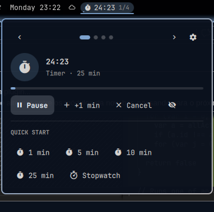

# omarchy-plugin-nowbar

A Samsung-style **Now Bar** for the [Omarchy](https://omarchy.org/) shell.
A single pill in the bar shows what's going on right now: music, a timer, a
screen recording, the camera being used... Scroll over it to switch between
activities and click it to see the details and controls.

## What it does

- **One pill for all live activities.** It shows the most important one, with
  a thin progress line and a `2/4` position marker. The pill has a fixed size;
  longer text scrolls around (or is cut with "…", if you prefer).
- **Scroll** over the pill to go to the next or previous activity.
- **Popup carousel** with ‹ › arrows, dots and ←/→ keys. Each card has the
  details and that activity's buttons.
- **New activities take the pill** when they matter more than the current one
  (camera on, recording started...). Switching by hand pauses this for a few
  seconds.
- **Quick toggles:** everything Omarchy's indicators widget does, on and off:
  Do Not Disturb, night light, stay awake, screen recording, reminder and
  dictation. It can replace that widget.
- **Quick start:** timers (1, 5, 10 and 25 minutes by default, configurable),
  stopwatch, Pomodoro and a 30 minute sleep timer, one click away in the popup.
- **Weather card** (the Now Brief): current conditions, the next hours and 3
  days, colored like the sky. It is one more activity in the carousel (and in
  the `2/3` marker), but never takes the pill from a live one; alone, it is
  what the pill shows. It replaces Omarchy's weather widget.
- **Live updates from scripts:** your own scripts can show their progress
  in the pill (builds, downloads, deploys...). `nowbar-run` does it for any
  command. See [Scripts](#scripts).

### Activities

| Samsung Now Bar         | Here                                                        | Source                                       |
| ----------------------- | ----------------------------------------------------------- | -------------------------------------------- |
| Media player            | One card per player: cover, title · artist, seekable progress bar, volume, play/pause, previous, next; highlight color taken from the cover | MPRIS |
| Timer / Stopwatch       | Built in: pause, +1 min, laps; a timer can also run until a time (`14:30`); survives a shell restart | This plugin (notifies when the timer ends) |
| Focus modes             | Pomodoro: focus / break cycles, a long break every 4         | This plugin (notifies at each change)        |
| Media sleep timer       | Pauses every player when it ends                            | This plugin                                  |
| Alarms / reminders      | Countdown to the next `omarchy-reminder`, clear             | `omarchy-reminder show --json`               |
| Voice / screen recorder | Screen recording with elapsed time, stop                    | `gpu-screen-recorder`                        |
| Interpreter / voice     | Dictation: listening / transcribing                         | `omarchy-voxtype-status`                     |
| Privacy indicator       | Camera and/or microphone in use, which apps, mute the mic   | PipeWire + who has `/dev/video*` open        |
| Modes & Routines / DND  | Do Not Disturb, stay awake, night light, VPN (while on), turn off | The shell's own IPC, `nmcli`, `tailscale` |
| Charging / battery      | `Charging · 63%` with time until full; low battery (≤ 15%) in red with time left | UPower                      |
| Connected devices       | A Bluetooth device that just connected, with its battery, for 10 s | Quickshell Bluetooth                  |
| Screenshot toolbar      | A screenshot just saved, with thumbnail, Edit / Copy / Open, for 15 s | The screenshots folder (inotify)   |
| Now Brief               | Weather card: temperature, feels like, wind, humidity, rain, sunrise/sunset, next hours, 3 days; Omarchy update notice | wttr.in (Omarchy's saved location), `omarchy-update-available` |
| Live Updates (Android)  | Anything a script sends with `nowbar push`, or a command run with `nowbar-run` | IPC                         |

Not ported, since the desktop has no source for them: navigation, ride and
food delivery, sports scores, wallet tickets, workouts. Scripts can still
show those through `push`.

## Preview



## Usage

| Action        | Effect                                                          |
| ------------- | --------------------------------------------------------------- |
| Left click    | Open/close the popup                                            |
| Scroll        | Next / previous activity                                        |
| Middle click  | Main action of the activity (pause timer, play/pause, stop...)  |
| Right click   | Hide the activity until it changes (a new track, timer paused...) |

### Popup keys

| Key              | Effect                                   |
| ---------------- | ---------------------------------------- |
| ← / → (h / l)    | Previous / next activity                 |
| Tab / Shift+Tab  | Next / previous activity                 |
| Enter / Space    | Main action                              |
| x                | Hide the activity until it changes       |
| 1 – 6            | Start the quick start timer with that number |
| s                | Start the stopwatch                      |
| p                | Start a Pomodoro                         |
| c                | Options                                  |
| q / Esc          | Close                                    |

> **Note:** while the popup is open it has the keyboard focus, like every
> Omarchy panel. Keys you type go to the popup, so Space or Enter can pause
> the timer.

## IPC

Everything goes through `omarchy-shell nowbar <method> [args]`:

| Method                    | What it does                                                    |
| ------------------------- | --------------------------------------------------------------- |
| `next` / `prev`           | Switch the pill to the next / previous activity                 |
| `toggle`                  | Open/close the popup (on the focused monitor)                   |
| `focus <id or module>`    | Focus an activity: `timer`, `media`, `privacy`, `build`...      |
| `primary`                 | Main action of the focused activity                             |
| `act <activity> <action>` | Any action, e.g. `act timer cancel`, `act media next` (`media` is the focused player) |
| `dismiss`                 | Hide the focused activity until it changes                      |
| `timer <duration>`        | Start a timer: `90` (seconds), `25m`, `1h30m`, or until `14:30` |
| `stopwatch`               | Start the stopwatch                                             |
| `pomodoro`                | Start a Pomodoro                                                |
| `weather`                 | Open the popup on the weather card                              |
| `quick <id>`              | A Quick toggle: `dnd`, `nightlight`, `stayAwake`, `record`, `reminder`, `dictation` |
| `sleep <duration>`        | Pause the media after `30` (minutes), `1h`, or at `23:00`       |
| `push <id> <json>`        | Add or update an activity from a script                         |
| `remove <id>`             | Remove a pushed activity                                        |
| `settings [tab]`          | Open the popup on the options (`activities`, `look`, `timers`, `weather`) |
| `status`                  | JSON with the activities, the focused one, the cover color and the brief |

Keyboard shortcuts go in `~/.config/hypr/bindings.lua`. These keys are free
in the default Omarchy bindings:

```lua
o.bind("SUPER + period", "Now Bar: next activity", "omarchy-shell nowbar next")
o.bind("SUPER + SHIFT + period", "Now Bar: previous activity", "omarchy-shell nowbar prev")
o.bind("SUPER + ALT + period", "Now Bar: details", "omarchy-shell nowbar toggle")
o.bind("SUPER + CTRL + ALT + period", "Now Bar: main action", "omarchy-shell nowbar primary")
```

`primary` runs the focused activity's main action (play/pause, pause the
timer, stop the recording...) without opening the popup.

## Weather

The weather card replaces Omarchy's weather widget: same source (wttr.in),
same saved location (`omarchy-weather-location`), °C or °F the same way
(or set in the options). It shows:

- the temperature, condition and place, today's high and low, feels like;
- wind, humidity, today's chance of rain, and the next sunset (or sunrise);
- the next hours (3-hour steps), with the rain chance when it's 20% or more;
- today and the next 2 days, each with its range on a shared temperature bar.

With "Dynamic colors" on, the card takes the color of the sky: gold for sun,
blue for rain, indigo at night...

To use it in place of Omarchy's weather widget, click **Use instead of the
weather widget** on the weather card (or **Replace** next to "Weather widget"
in the options). That turns `omarchy.weather` off and points Omarchy's weather
shortcut, SUPER+CTRL+ALT+W, at the weather card. **Restore**, in the same
place, undoes both and puts the widget back where it was in the bar.

> **This edits your config:** the shortcut goes in
> `~/.config/hypr/bindings.lua`, inside a block marked
> `-- >>> vinicgobbi.nowbar weather` / `-- <<< vinicgobbi.nowbar weather`
> (a copy of the file is kept next to it first, as
> `bindings.lua.bak.nowbar-<time>`). Nothing changes until you click; no
> `sudo` needed. The same script works from a terminal:

```bash
~/.config/omarchy/plugins/vinicgobbi.nowbar/bin/nowbar-weather-widget replace   # or restore, status
```

## Indicators

The Now Bar does what Omarchy's indicators widget does. What is on shows up
as an activity (recording, dictation, reminders; Do Not Disturb, night light
and stay awake in the Modes card), and the popup's **Quick toggles** turn each
one on or off:

| Toggle  | On                                     | Off                     |
| ------- | -------------------------------------- | ----------------------- |
| DND     | Silences notifications                 | Allows them again       |
| Night   | Night light                            | Day light               |
| Awake   | No idle lock or screensaver            | Normal idle             |
| Record  | Opens Omarchy's screen recording menu  | Stops the recording     |
| Remind  | Opens Omarchy's reminder panel         |                         |
| Dictate | Opens voxtype's settings (if installed)|                         |

To use it in place of the indicators widget, click **Use instead of Omarchy's
indicators** under the Quick toggles (or **Replace the indicators** in the
options, Activities tab). That turns `omarchy.indicators` off; its place in
the bar is remembered, and **Restore** puts it back there. With the widget
off, the Now Bar also answers `omarchy-shell omarchy.indicators refresh`
(called by `omarchy-reminder` and the screen recorder), so those show up at
once. Nothing here needs `sudo`. From a terminal:

```bash
~/.config/omarchy/plugins/vinicgobbi.nowbar/bin/nowbar-indicators replace   # or restore, status
```

## Media keys

The Now Bar takes over Omarchy's media controls: it is a clone of the
built-in `omarchy.media`, so enabling it turns that one off and answers its
`media` IPC target. The media keys keep working with nothing else enabled:

| Key / command                                         | What it does                                       |
| ----------------------------------------------------- | -------------------------------------------------- |
| Play/Pause key, `omarchy-shell media playPause`       | Pauses what is playing; otherwise plays the focused card, the last player used, or any player with a track |
| Next / Previous keys, `media next` / `media previous` | On the focused player, else the one playing        |
| `media play` / `media pause`                          | Same choice of player                              |
| Shift+Play, `omarchy-audio-source-switch`             | Next player, moving the playback to it (`sourceSwitch`, `sourceSwitchPrevious`) |
| `media sourceNext` / `media sourcePrevious`           | Next / previous player, without touching playback  |
| `media status`                                        | JSON about the player the keys act on              |

Each action shows Omarchy's OSD with the track (after next/previous, the new
one). Only one plugin can answer the `media` target: turn off
omarchy-plugin-media (or the built-in media widget) when using the Now Bar.

## Scripts

### `nowbar-run`: show any command in the pill

`bin/nowbar-run` runs a command in the foreground, exactly as given, and shows
it in the pill with the elapsed time. When it ends the card turns into
"Done in 1:23" or "Failed (exit 2) after 1:23" for a while, and a notification
is sent.

```bash
~/.config/omarchy/plugins/vinicgobbi.nowbar/bin/nowbar-run make
~/.config/omarchy/plugins/vinicgobbi.nowbar/bin/nowbar-run -t "System update" -- omarchy-update
~/.config/omarchy/plugins/vinicgobbi.nowbar/bin/nowbar-run -q -- ./deploy.sh   # -q: no notification
```

To type just `nowbar-run`, add an alias to your shell's config:

```bash
alias nowbar-run="$HOME/.config/omarchy/plugins/vinicgobbi.nowbar/bin/nowbar-run"
```

Its exit code is the command's, and Ctrl+C goes to the command. It needs
`jq` (part of Omarchy).

### Live updates from scripts

```bash
omarchy-shell nowbar push build '{"title":"Build #42","subtitle":"Compiling","progress":0.4,"pill":"Build 40%"}'
omarchy-shell nowbar push build '{"title":"Build #42","subtitle":"Done","progress":1,"ttl":30}'
omarchy-shell nowbar remove build
```

| Field      | Meaning                                                                   |
| ---------- | ------------------------------------------------------------------------- |
| `title`    | Required. Up to 80 characters                                             |
| `subtitle` | Second line in the popup                                                  |
| `pill`     | Shorter text for the pill (defaults to `title`)                           |
| `icon`     | A single Nerd Font glyph                                                  |
| `progress` | 0 to 1; leave it out for none                                             |
| `ttl`      | Seconds until it goes away on its own (max 24 h); leave it out to keep it |
| `priority` | `high`, `normal` (default) or `low`                                       |
| `urgent`   | `true` paints it red, like recording                                      |
| `state`    | `running`, `success` or `error` (red): sets the default icon              |
| `elapsed`  | `true` adds the time since the first push with this id                    |

The id is 1–32 letters, digits, `.`, `_` or `-`. Pushed activities are **text
only**: nothing in them is run, opened or shown as markup, and control
characters are stripped. At most 8 are kept, and they're gone after a shell
restart.

## Install

```bash
omarchy plugin add https://github.com/vinicgobbi/omarchy-plugin-nowbar --enable
```

The pill goes in the center of the bar by default. No step needs `sudo`,
polkit or the keyring.

- **Camera detection** reads which of *your own* processes have
  `/dev/video*` open (`/proc/<pid>/fd`, no root). With `inotify-tools`
  installed, it is checked only when a camera is opened or closed. Without
  it, it is checked every 5 seconds.
- **Cover art** is downloaded only over https from public hosts (or read from a
  local file), capped at 8 MB and 4096 px, checked to be a real PNG/JPEG/GIF/WebP,
  and cached in `~/.cache/omarchy/vinicgobbi.nowbar`. Same rules as
  omarchy-plugin-media.
- **Modes** (Do Not Disturb, stay awake) follow their state files, so they
  show up within a second; night light is checked every 5 seconds.
- **Timer and stopwatch state** is kept in
  `~/.local/state/vinicgobbi.nowbar/state.json`.
- **When a timer or a Pomodoro phase ends**, a notification is sent with
  `omarchy-notification-send`, so Do Not Disturb applies to it.
- **Screenshots** are noticed in the same folder `omarchy-capture-screenshot`
  saves to (`$OMARCHY_SCREENSHOT_DIR`, else `~/Pictures`), only with
  `inotify-tools` installed. "Edit" opens `$OMARCHY_SCREENSHOT_EDITOR`
  (`tensaku-edit` by default).
- **Media cards:** every player that is playing gets a card; a player you
  paused keeps its card (up to 3) so you can resume it, until it closes or
  you hide the card.
- **Reminders** show up as soon as `omarchy-reminder` sets them (it creates a
  transient systemd timer, watched with `inotify-tools`); without it, within
  10 seconds.
- **Weather** is fetched from wttr.in every 20 minutes (and when the popup
  opens with a reading older than 10), for your saved Omarchy weather
  location or a guess from your IP; `omarchy-update-available` runs every 3
  hours. Turn the "Weather" activity off to stop both.

## Options

The gear in the popup (or `c`, or `omarchy-shell nowbar settings`) opens the
options, one tab at a time (Tab / Shift+Tab to switch):

- **Activities:** which activities can show up (live ones: media, timers,
  reminders, recording, dictation, camera/mic; system ones: modes and VPN,
  battery, Bluetooth, screenshots, weather, scripts), whether a new activity
  takes the pill, and replacing (or restoring) Omarchy's indicators widget.
- **Look:** the pill's text width, scrolling or cutting long text, the
  progress line, the `2/4` marker, the Quick toggles, what it shows when idle (the weather card,
  an empty pill, or nothing), and the dynamic colors (media from the album
  cover, weather from the sky).
- **Timers:** the Quick start timers (minutes, comma separated) and the
  Pomodoro focus, break and long break lengths.
- **Weather:** °C, °F or automatic, and replacing (or restoring) Omarchy's
  weather widget.

The same options are in the widget's settings. **Reset** restores them all.

## License

MIT
